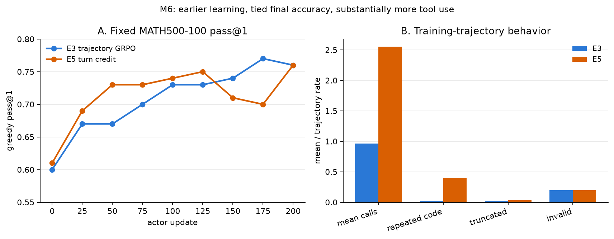
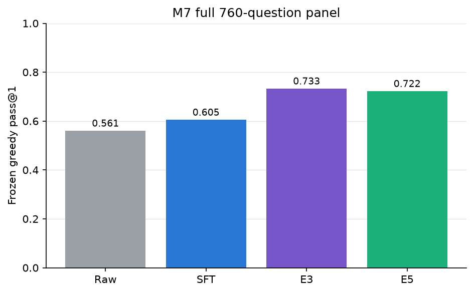

# Main results — M6 fixed panel and M7 unified evaluation

本页先保留 M6 冻结的 fixed MATH500-100 训练曲线与机制证据，再报告 M7 canonical unified
evaluation。M6回答“训练过程中发生了什么”；M7在同一760题、同一生成协议下回答四个endpoint role是否泛化。

## 实验边界

E3 与 E5 都从 `sft/checkpoints/qwen3-1.7b-sft` 独立启动，使用相同的 train/validation data、seed、
64 prompts × 8 rollouts、生成预算、answer+format reward、loss mask、optimizer、KL/clip 和 200-step
validation cadence。唯一 treatment 是：E5 在 native GRPO `A_traj` 后应用冻结的

\[
A_{turn}(t)=A_{traj}+0.5(s_t-\bar{s}_t).
\]

`s_t=1` 只表示成功执行且被后续文本证据采纳的工具结果；这是 deterministic heuristic evidence，
不是 learned step value、PRM 或因果 judge。smoke 的用户人工盲审为 14 TP / 1 FP，precision 0.9333，
Wilson 95% CI `[0.7018, 0.9881]`，通过冻结的 formal gate。

## 主结果

| Step | 0 | 25 | 50 | 75 | 100 | 125 | 150 | 175 | 200 |
|---:|---:|---:|---:|---:|---:|---:|---:|---:|---:|
| E3 trajectory GRPO | 0.60 | 0.67 | 0.67 | 0.70 | 0.73 | 0.73 | 0.74 | **0.77** | **0.76** |
| E5 turn credit | 0.61 | 0.69 | **0.73** | **0.73** | **0.74** | **0.75** | 0.71 | 0.70 | **0.76** |
| E5 − E3 | +0.01 | +0.02 | **+0.06** | +0.03 | +0.01 | +0.02 | −0.03 | **−0.07** | 0.00 |

| 指标 | E3 | E5 | E5 − E3 |
|---|---:|---:|---:|
| 0–100 normalized AUC（primary） | 0.67625 | **0.70625** | **+0.03000** |
| 0–200 normalized AUC | 0.71125 | **0.716875** | +0.005625 |
| 首次达到 0.70 | step 75 | **step 50** | −25 step |
| 首次达到 0.73 | step 100 | **step 50** | −50 step |
| final pass@1 | **0.76** | **0.76** | 0.00 |
| peak pass@1 | 0.77 @175 | 0.76 @200 | −0.01 |

E5 的早期学习明确更快，但优势没有维持到终点：150/175 时分别落后 E3 3/7 题，step 200 回到同为
76/100。逐题配对 bootstrap 的 final accuracy difference 为 `0.00`，95% CI `[-0.06, 0.06]`。
因此不能用 early AUC 把 E5 写成最终能力提升，也不能用中后期两个点把它写成确定退化。

## 机制审计

formal gate 全量重验 102,400 条训练 trajectory、363,350 个 assistant turn：UID 唯一、turn span、mask、
公式与 proof-segment mismatch 均为 0。90,498 条（88.38%）满足冻结的 mixed-quality 定义；按五个 issue
category 配额和 `sha256(run,step,trajectory_uid,sample_id)` 固定选出 30 条，而不是按 reward 或改善方向选例。

| 审计对象 | 总数 | 预期方向生效 | correction=0 | 方向违约 |
|---|---:|---:|---:|---:|
| useful `s_t=1` turn | 213,403 | 99,996 正向 | 113,407 | 0 |
| 非 no-tool 问题 turn | 47,806 | 41,444 负向 | 6,362 | 0 |

每条真实 E5 rollout 同时保存 native `A_traj`，所以能做算法内反事实：若按 E3 rule，所有 policy turn
得到同一个 `A_traj`；E5 再对 useful/problem turn 作相反方向的相对修正。全量 trajectory 中没有一条出现
同轨迹 `A_traj` 不恒定。30 条审计覆盖 ambiguous output、budget/truncation、no-tool/final、execution/parser
failure、success-but-unused/mentioned 五类，每类 6 条，并保留 visible result、adoption evidence、span 和 mask。

这个机制证据证明 treatment 真的改变了信用，而不是空开关；它不证明 heuristic 判断了真实因果价值。
尤其 final/no-tool turn 也参与 position comparison，容易相对同位置的 adopted tool turn受罚，这是 Tier A
预注册且不事后修改的局限。

## 工具行为与稳定性

| 102,400 条训练轨迹指标 | E3 | E5 | 变化 |
|---|---:|---:|---:|
| mean tool calls | 0.9627 | **2.5509** | +1.5881 |
| 4-call fraction | 2.71% | **44.05%** | +41.34pt |
| repeated-code trajectory | 2.02% | **39.71%** | +37.69pt |
| trivial-code trajectory | 0.17% | **5.60%** | +5.44pt |
| per-call execution success | 80.53% | **91.01%** | +10.48pt |
| any execution-error trajectory | 12.22% | 15.28% | +3.06pt |
| invalid rate | 20.06% | **19.52%** | −0.54pt |
| truncation rate | 1.70% | **3.42%** | +1.72pt |
| error recovery | 5,427/13,183 = 41.17% | 6,752/16,477 = 40.98% | −0.19pt |

E5 学会了“更多、且单次更成功地调用”，但没有提高出现错误后的条件恢复率。fixed-100 step-200 中，
E5 有 93/100 条出现 4-call overuse secondary tag，E3 只有 2/100。这与大量重复 code 一致：heuristic
adoption correction 可以奖励反复调用并复述同一结果，即使 outcome reward 没有增加。

稳定性本身没有数值病态：E5 entropy 范围 `0.1945–0.2906`，PPO KL 范围约
`−1.08e−4–1.09e−4`，200 个点全部 finite。换言之，这不是 NaN/KL explosion，而是一个可解释的行为目标偏差。

## Paired failure transition

step-200 的冻结 100 题产生：

- E3 failed → E5 correct：5/24，conditional fix rate 0.2083，95% CI `[0.0500, 0.3913]`；
- E3 correct → E5 failed：5/76，new failure rate 0.0658，95% CI `[0.0135, 0.1282]`；
- unchanged correct：71；unchanged failed：19。

5 个 fixed 来自 3 个 semantic/constraint miss、1 个 execution-error failure、1 个 result-misread；5 个
new failure 则是 4 个 semantic/constraint miss和 1 个 result-misread。所有分类型分母都很小，CI 很宽；
没有一类达到“已解决”的证据门槛。完整 primary matrix、secondary tag transitions、逐题 evidence pointers 和
checkpoint-blinded manual Codex adjudication见 `reports/03_badcase_taxonomy.md` 及 run `analysis/`。

## 最终判读

M6 给出一个 mixed/negative 结论：**Tier-A turn credit 提高了早期样本效率，但没有提高最终正确率；它在
正确实现逐轮相对信用的同时，强烈诱导 repeated/maximum-budget tool use。** 这说明“比 trajectory-level
broadcast 更细”本身不够，step signal 的语义与状态对齐同样关键。

最可能的限定解释是：当前 horizon 最多四次工具调用，native group outcome variance 已经提供较强信号；
position alignment 把 final/no-tool 与 tool-call turn混比；visible-text adoption 可以被重复调用/复述满足；
固定 `β=0.5` 未调优。按预注册协议没有为改善结果调 β、改 heuristic、追加 seed、启动 Tier B/GiGPO、
E7 或 M7。

## 证据索引

- formal run 与五件套：`rl/runs/e5_turn_credit_20260823_082012/`
- 完整性：`analysis/formal_completion_gate.json`、`analysis/m6_e5_completion_manifest.json`
- performance/behavior：`analysis/e3_e5_performance_behavior.json`
- mechanism：`analysis/mechanism_analysis.json`、`analysis/mixed_quality_mechanism_audit.jsonl`
- paired transition：`analysis/paired_failure_transition_analysis.json`、`analysis/paired_failure_transitions.jsonl`
- blinded packet/adjudication：`analysis/paired_failure_blinded_cases.jsonl`、`rl/m6_failure_adjudications.jsonl`

## M7 unified evaluation（canonical，2026-08-25）

### 完整性、口径与解释顺序

唯一run为`eval/runs/m7_unified_eval_20260824_201032/`，frozen-v3 manifest为
`b765ec2c…5b05a4`。raw与strict-scored均为15,200/15,200：greedy 3,040、sampled 12,160，32个shard，
3,800个四role pairing group；missing、unexpected、duplicate、conflict和infrastructure failure全部为0，
full exact-key digest为`c43ce719…fa8b8`。这些分母见`metrics/completeness.json`与
`metrics/full_scored_completeness.json`，canonical文件仍由`hashes.sha256`保护。

greedy n=1是primary diagnostic。sampled为每题四个固定matched index；pass@k与paired transitions只作为
secondary/exploratory证据。bootstrap为10,000次、seed 42、two-sided percentile 95% CI，在四个source
stratum内按question cluster重采样；sampled抽中题时携带该题全部四个index。全部accuracy-delta报告有
10,000个effective replicate；少数小source的条件率replicate遇到真实零分母，按冻结规则记NA而不加伪计数。

### 四role × 四source performance

Greedy pass@1报告严格exact count：

| Source | Raw | SFT | E3 | E5 |
|---|---:|---:|---:|---:|
| MATH500 | 288/500 = 0.576 | 297/500 = 0.594 | **383/500 = 0.766** | 375/500 = 0.750 |
| AIME2024 | 3/30 = 0.100 | 2/30 = 0.067 | **4/30 = 0.133** | **4/30 = 0.133** |
| AIME2025 | 3/30 = 0.100 | **5/30 = 0.167** | 4/30 = 0.133 | **5/30 = 0.167** |
| GSM8K | 132/200 = 0.660 | 156/200 = 0.780 | **166/200 = 0.830** | 165/200 = 0.825 |
| **FULL760** | 426/760 = 0.561 | 460/760 = 0.605 | **557/760 = 0.733** | 549/760 = 0.722 |

Sampled pass@1/2/4如下。pass@1也等于四个matched index上的strict-correct count除以4N；pass@2和
pass@4是冻结的per-question unbiased estimator之和除以N，exact estimator sums保存在
`metrics/pass_at_k.json`。

| Source | Raw p@1 / p@2 / p@4 | SFT | E3 | E5 |
|---|---:|---:|---:|---:|
| MATH500 | .575 / .707 / .800 | .616 / .732 / .814 | **.775 / .847 / .890** | .771 / .837 / .880 |
| AIME2024 | .083 / .150 / .267 | .092 / .133 / .167 | **.208 / .311 / .433** | .200 / .300 / .400 |
| AIME2025 | .075 / .122 / .167 | .117 / .178 / .267 | **.225 / .294 / .367** | .167 / .233 / .267 |
| GSM8K | .694 / .819 / .885 | .763 / .853 / .895 | .821 / **.873** / **.910** | **.824** / .873 / **.910** |
| **FULL760** | .567 / .692 / .776 | .614 / .718 / .788 | **.743 / .811 / .857** | .738 / .802 / .845 |

FULL760 sampled pass@1的trajectory分子/分母依次为raw 1,723/3,040、SFT 1,867/3,040、E3
2,258/3,040、E5 2,245/3,040。两种setting都把E3置于最强endpoint：E5在greedy少8题、sampled少13条
matched trajectory，且p@2/p@4也没有反转这个排序。

### Preregistered paired transitions与bootstrap

四格顺序为fixed / new / unchanged-correct / unchanged-failed；每行总和严格等于setting denominator。

| Stage transition | Setting | 四格exact count | Accuracy Δ | 95% CI | Conditional fix | New failure rate |
|---|---|---:|---:|---:|---:|---:|
| Raw→SFT | greedy | 109 / 75 / 351 / 225 | +0.0447 | [0.0105, 0.0789] | 109/334 = .326 | 75/426 = .176 |
| Raw→SFT | sampled | 451 / 307 / 1416 / 866 | +0.0474 | [0.0276, 0.0671] | 451/1317 = .342 | 307/1723 = .178 |
| SFT→E3 | greedy | 127 / 30 / 430 / 173 | **+0.1276** | **[0.0974, 0.1592]** | 127/300 = .423 | 30/460 = .065 |
| SFT→E3 | sampled | 533 / 142 / 1725 / 640 | **+0.1286** | **[0.1089, 0.1484]** | 533/1173 = .454 | 142/1867 = .076 |
| E3→E5 | greedy | 47 / 55 / 502 / 156 | −0.0105 | [−0.0368, 0.0158] | 47/203 = .232 | 55/557 = .099 |
| E3→E5 | sampled | 195 / 208 / 2050 / 587 | −0.0043 | [−0.0178, 0.0092] | 195/782 = .249 | 208/2258 = .092 |

Raw→SFT是约+4.5pt的aggregate improvement，greedy主要由GSM8K驱动；sampled的GSM8K与MATH500
CI排除0。SFT→E3是最强、最一致的阶段增益，两setting均约+12.8pt；greedy的GSM8K/MATH500以及
sampled四source都为正。E3→E5则同时出现修复和新增，但新增略多；aggregate CI跨0。source-level greedy
delta为AIME2024 0.0、AIME2025 +.033、GSM8K −.005、MATH500 −.016，均跨0。sampled AIME2025为
−.0583、CI `[−.1083,−.0083]`，但它是30题上的secondary/exploratory signal，不能单独升级为强因果结论。
完整source四格与全部CI见`transitions/{raw_to_sft,sft_to_e3,e3_to_e5}.json`和
`transitions/bootstrap.json`。

### Tool behavior：E5 treatment effect跨source泛化

FULL panel的count/denominator直接取自`metrics/tool_behavior.json`：

| Role / setting | Mean calls | 4-call | repeated code | truncation | any error | error recovery | per-call success |
|---|---:|---:|---:|---:|---:|---:|---:|
| Raw greedy | 735/760 = .967 | 76/760 = 10.0% | 78/760 = 10.3% | 136/760 = 17.9% | 111/760 = 14.6% | 20/111 = 18.0% | 460/735 = 62.6% |
| SFT greedy | 954/760 = 1.255 | 59/760 = 7.8% | 51/760 = 6.7% | 115/760 = 15.1% | 102/760 = 13.4% | 34/102 = 33.3% | 733/954 = 76.8% |
| E3 greedy | 675/760 = .888 | 10/760 = 1.3% | 22/760 = 2.9% | 73/760 = 9.6% | 51/760 = 6.7% | 22/51 = 43.1% | 595/675 = 88.1% |
| E5 greedy | 2854/760 = **3.755** | 706/760 = **92.9%** | 702/760 = **92.4%** | 760/760 = **100%** | 25/760 = 3.3% | 10/25 = 40.0% | 2813/2854 = **98.6%** |
| Raw sampled | 3083/3040 = 1.014 | 305/3040 = 10.0% | 315/3040 = 10.4% | 472/3040 = 15.5% | 463/3040 = 15.2% | 106/463 = 22.9% | 1953/3083 = 63.3% |
| SFT sampled | 4101/3040 = 1.349 | 270/3040 = 8.9% | 243/3040 = 8.0% | 415/3040 = 13.7% | 493/3040 = 16.2% | 158/493 = 32.0% | 3147/4101 = 76.7% |
| E3 sampled | 2913/3040 = .958 | 37/3040 = 1.2% | 76/3040 = 2.5% | 152/3040 = 5.0% | 242/3040 = 8.0% | 112/242 = 46.3% | 2562/2913 = 88.0% |
| E5 sampled | 11963/3040 = **3.935** | 2956/3040 = **97.2%** | 2896/3040 = **95.3%** | 3039/3040 = **100.0%** | 146/3040 = 4.8% | 81/146 = 55.5% | 11741/11963 = **98.1%** |

E3相对SFT调用更选择性，同时降低4-call、重复、错误与截断并提高条件恢复。E5则几乎总把四次预算用满，
而且这种效应不是单一数据集造成：greedy的E5 4-call率为AIME2024 60.0%、AIME2025 66.7%、GSM8K
98.5%、MATH500 94.2%；sampled依次为87.5%、90.0%、100%、97.2%。E5的per-call success反而接近
98%，说明问题不是工具语法崩坏，而是成功调用与重复调用本身成为容易优化的proxy。E5 greedy 701/760、
sampled 2916/3040以assistant-turn budget结束，几乎没有正常final termination；模型通常已产生boxed文本后
仍继续调用，直到budget终止。

这里应写作**强behavioral treatment effect与credit-signal/proxy gaming**：M6 ledger证明逐轮correction确实
生效，M7证明其行为后果跨source/setting泛化；但E5没有直接优化一个外显shaped reward总分，因此不能仅凭
over-calling自动等同classic reward hacking。更干净的reward-shaping exploitation证据来自E4，见
`reports/04_reward_hacking.md`。

### M6→M7最终判读

M7验证了M6的两个endpoint结论：E5没有超过E3 final accuracy，且severe over-calling在完整MATH500、
AIME2024、AIME2025、GSM8K与greedy/sampled均出现。M7不能验证M6“early learning更快”，因为这里只比较
冻结endpoint，没有统一full-panel训练曲线。于是项目级结论是：**E3是最强endpoint stage；Tier-A turn credit
改变了学习过程与行为，却没有转化为更强最终能力。** 这是同起点、同训练量recipe的直接比较，但仍只有单seed、
固定`β=0.5`、短horizon与position-aligned adoption heuristic，`causal_claim_allowed=false`的机器guardrail
必须保留。没有为null/negative endpoint结果追加seed、β sweep、Tier B、E7或post-hoc tuning。

M7证据入口：`metrics/pass_at_k.json`、`metrics/tool_behavior.json`、`metrics/completeness.json`、
`transitions/bootstrap.json`、`taxonomy/audit_metrics.json`和`analysis_hashes.sha256`，均位于canonical run目录。

## M8 E5-v2：守恒的轮级信用分配（canonical，2026-09-05）

### 动机与设计变更

M6/M7 的 E5 v1 修正项 `β(s_t − s̄_t)` 以组内同位置均值为基线，在轨迹内不守恒：no-tool turn 中 33,663 次拿到
负修正，逐轨迹净修正随调用数单调（step 200 时 0/1/2/3/4 次调用为 −0.41/−0.47/−0.23/−0.05/+0.01），并在
组内 `score` 零方差的 group（step 200 时 48%）里成为唯一梯度。它测的是"隐式稠密奖励值不值"。E5-v2 只改四点
（`plans/M8.md` §3）：基线改为轨迹内 token 加权均值 `s̃`，`Σ_t c_t·n_t = 0` 逐轨迹精确成立；只有恰好一次调用的
turn 参与；AST 归一化后重复的代码与 `\boxed{` 之后的调用 `s_t = 0`；组内 `score` 零方差不施加修正。β、adoption
heuristic、起点、数据、rollout 与优化超参与 E3/E5-v1 完全相同（resolved-config diff 仅 `turn_credit.*`、agent loop
注册名与 project_name）。

### 训练侧

run `rl/runs/e5v2_conserved_credit_20260905_003041/`，200/200 step，102,400 轨迹 / 170,501 turn，守恒残差
≤ 1.1e-13，零方差组无非零修正；step 147 遭 pod 中断，从 step-125 checkpoint 恢复，proof 分两段、recovery ledger
完整。预注册行为门禁（后 25 step）全部达线：mean calls 0.856（E3 0.96、E5-v1 2.55）、4-call 1.13%（2.7%、44.1%）、
repeated-code 0.76%（2.0%、39.7%）、训练截断 0.51%（1.7%、3.4%）。treatment exposure（收到非零修正的轨迹）从
前 25 step 的 10.4% 衰减到后 25 step 的 4.2%，多调用轨迹占比从 24% 降到 14%。fixed-100 greedy 曲线
`0.61/0.66/0.73/0.74/0.69/0.72/0.75/0.73/0.73`，AUC(0–100) 0.695（E3 0.676，E5-v1 0.706），final 0.73（E3/E5-v1 0.76）。

### 评测（协议 v4，只新增一个 role）

`eval/runs/m8_e5v2_eval_20260905_134737/`：protocol v4 在 v3 的 66 文件闭包上仅加 E5-v2 角色/物化/M8 evaluator 绑定，
语义校验器证明 panel/generation/tool/verifier/taxonomy/pairing/bootstrap 字段与 v3 逐字段相同；E5-v2 3,800/3,800，
raw/SFT/E3/E5-v1 复用 M7 canonical（157 个产物 hash 复用前重验）。

| role | greedy FULL760 | MATH500 | AIME24 | AIME25 | GSM8K | sampled pass@1 / @2 / @4 |
|---|---|---|---|---|---|---|
| E3 | 557/760 = .733 | .766 | .133 | .133 | .830 | .743 / .811 / .857 |
| E5-v1 | 549/760 = .722 | .750 | .133 | .167 | .825 | .739 / .802 / .845 |
| **E5-v2** | **563/760 = .741** | .772 | .200 | .200 | .825 | **.755 / .818 / .859** |

| 配对（10k source 分层 bootstrap） | setting | fixed / new | Δ | 95% CI |
|---|---|---|---|---|
| E3 → E5-v2（primary） | greedy | 55 / 49 | +0.79pt | [−1.84, +3.42] |
| E5-v1 → E5-v2（secondary） | greedy | 61 / 47 | +1.84pt | [−0.79, +4.47] |
| E3 → E5-v2 | sampled（exploratory） | — | +1.22pt | [−0.10, +2.53] |
| E5-v1 → E5-v2 | sampled（exploratory） | — | +1.64pt | [+0.36, +2.93] |

greedy per-source Δ：MATH500 +0.60pt [−2.80, +4.20]、AIME2024 +6.67pt [−6.67, +20.00]、AIME2025 同、GSM8K −0.50pt
[−4.50, +3.50]，均跨 0。

| greedy FULL760 行为 | E3 | E5-v1 | E5-v2 |
|---|---|---|---|
| mean tool calls | 0.888 | 3.755 | **0.604** |
| 4-call 占比 | 1.3% | 92.9% | **0.8%** |
| 评测截断率 | 9.6% | 100% | **8.7%** |
| repeated-code 轨迹 | 2.9% | 92.4% | **1.5%** |
| per-call 执行成功率 | 88.1% | 98.6% | 90.6% |
| no-tool 轨迹占比 | — | — | 48.6% |

sampled FULL760：E5-v2 calls 0.616、4-call 0.6%、截断 3.2%（E3 0.958 / 1.2% / 5.0%；E5-v1 3.935 / 97.2% / 99.97%）。

### 预注册判读：情形 A

按 `plans/M8.md` §9.2：greedy Δ CI 跨 0，且 fixed-100 早期 AUC 差 +1.87pt < 2pt → **情形 A（无差异）**；行为线全过、
exposure 10.4% ≥ 8%，前置条件成立，条款不触发。早期 AUC 差距离情形 B 的 2pt 线仅 0.13pt，按预注册规则不作事后调整。
写法（§9.2 A）："≤4 轮 horizon 下组内 outcome 方差已足够，轨迹内再分配不增加信息"，并补两点：

1. **v1 的失效机制被反事实证实**：同起点、同训练量、只把修正项改成守恒，over-calling 完全消失（4-call 92.9% → 0.8%、
   截断 100% → 8.7%），终点不比 E3 差。v1 的行为漂移与早期 +3pt 来自非守恒修正项等价的隐式奖励，而非轮级信用本身。
2. **功效受 exposure 衰减限制**：守恒的再分配只在"同一轨迹有 ≥2 次可区分调用"时起作用；策略在 ≤4 轮预算下很快收敛到
   单次调用（评测中 48.6% 轨迹零调用），后期只有 4.2% 轨迹被修正。因此 A 只能写"在此 horizon 与 exposure 下未检出增益"，
   不能外推为"信用分配无用"。sampled E5-v1→E5-v2 CI 不跨 0 是 secondary 证据，按 M7 guardrail 不作因果主张。

M8 证据入口：`eval/runs/m8_e5v2_eval_20260905_134737/metrics/m8_headline.json`（含机械判读）、`metrics/pass_at_k.json`、
`metrics/tool_behavior.json`、`transitions/e3_to_e5v2*.json`、`transitions/e5v1_to_e5v2*.json`、`taxonomy/coarse_metrics.json`、
`hashes.sha256`；训练侧 `rl/runs/e5v2_conserved_credit_20260905_003041/analysis/formal_completion_gate.json`；
离线反事实 `analysis/e5v2_offline_counterfactual.json`；协议 `eval/diagnostic_protocol_v4.json`、`eval/diagnostic_freeze_v4.sha256`。

---

## M9 E3-NoTool：无工具 GRPO 对照臂（canonical，2026-09-07）

### 动机：把"学会用工具"与"RL 提升推理"分开

项目此前所有 RL 结果都在 TIR 协议下取得，SFT→E3 的 +12.76pt 里多少来自工具、多少来自 RL 本身，
现有证据分不开（`reports/qa_log.md` Q14 的"因果空洞"）。M9 只改一件事——把工具从 prompt 与 rollout 里拿掉——
在同起点、同数据、同配方、同 200 步下再训一条臂，并新增四个无工具评测角色。

### 训练侧

`rl/runs/e3notool_grpo_20260906_220907`，200/200 step（step 150 遭 pod 级 OOM 中断，从完整 step-125 恢复重算
126–200，`recovery/resume_from_125_20260907_140752/`；根因见 `reports/qa_log.md` Q17）。
本臂是项目第一个**零框架改动**的实验臂：treatment 就是 `multi_turn.enable=false` + veRL 原生 `single_turn_agent`，
E3→E3-NoTool 的 resolved-config diff **精确等于**预注册的 5 条路径。

完整性与不变量（`analysis/formal_completion_gate.json`）：102,400 条 = 200×64×8，组结构完整；逐条断言 prompt 无
tool schema 且四个 tool 计数为 0；`<tool_call>` 标签吐出率训练全程 **1/102,400**、9 次验证全 0，§4 门禁未触发。
组内零方差比例 44.6%（前 25 步）→ 56.3%（后 25 步），显著高于 E3 的 26.6%（step 1）——**约一半 batch 无梯度信号**，
这是 M10 零方差过滤的直接动机。

fixed-100 greedy 曲线 .63/.75/.69/.72/.75/.76/.72/.71/.70（峰在 step 125）。该曲线 n=100、p≈0.73 时标准误约 4.4pt，
E5-v1/E5-v2 同样出现过 5pt 级中途回落；**判读一律用预注册的 step 200**，不作事后选点（step-125 敏感性分析见文末）。

### 评测：协议 v5，只加 `notool` 生成模式与四个角色

v5 manifest `5238d08e…b2e4d`（107 文件）。语义验证证明 v4 的 87 文件闭包逐字节不变、12 个冻结语义字段
（panel/generation/tool/verifier/taxonomy/pairing/bootstrap/persistence/prompt/data_isolation/file_sha256/
protocol_change_rule）逐字段相同，只新增 `generation_mode`、四个 notool 角色与 M9 evaluator 绑定。
`notool` 模式的唯一差别是 `apply_chat_template(..., tools=None)`、单轮生成、无 tool turn。

`eval/runs/m9_notool_eval_20260907_175726`：15,200/15,200，infra failure 0；复用 M7 canonical 157 个产物与
M8 canonical 30 个产物，hash 在 freeze、生成前、downstream 前各重验一次。

| greedy FULL760 pass@1 | TIR（有工具） | NoTool（无工具） | 工具的代价 |
|---|---|---|---|
| raw Qwen3-1.7B | 426/760 = .561 | **532/760 = .700** | **−13.95pt** [−17.63, −10.26] |
| SFT 起点 | 460/760 = .605 | 506/760 = .666 | −6.05pt（无预注册 CI） |
| E3 step-200 | **557/760 = .733** | 542/760 = .713 | −1.97pt [−4.74, +0.79] |
| E3-NoTool step-200 | 不适用（RL 阶段从未见 schema） | 550/760 = .724 | — |

（"工具的代价"= NoTool − TIR，同一权重换推理模式；`raw → raw-NoTool` 为 descriptive 配对，
`SFT → SFT-NoTool` 不在 §3 预注册配对表内，只报点估计。）

### 预注册判读：情形 B

| 配对（10k source 分层 bootstrap，greedy FULL760） | 地位 | fixed / new | Δ | 95% CI |
|---|---|---|---|---|
| **E3 → E3-NoTool** | **primary** | 47 / 54 | **−0.92pt** | **[−3.55, +1.71]** |
| SFT-NoTool → E3-NoTool | secondary | 88 / 44 | +5.79pt | [+2.89, +8.68] |
| raw-NoTool → SFT-NoTool（`D_start`） | secondary | 43 / 69 | −3.42pt | [−6.18, −0.79] |
| E3 → E3-NoTool-eval（同权重） | secondary | 51 / 66 | −1.97pt | [−4.74, +0.79] |
| SFT-NoTool → E3-NoTool-eval | secondary | 74 / 38 | +4.74pt | [+2.11, +7.50] |
| E3-NoTool-eval → E3-NoTool | secondary | 59 / 51 | +1.05pt | [−1.71, +3.82] |
| raw → raw-NoTool | descriptive | 160 / 54 | +13.95pt | [+10.26, +17.63] |

Δ = E3-NoTool − E3 = −0.92pt，CI 跨 0 → **情形 B**。按 §8 写法：

> 1.7B、≤4 轮、MATH 训练池下，SFT→RL 的增益主要是推理能力提升，**工具未提供额外准确率**。

必须同时披露的三条：

1. **附加预注册不成立**：§8 要求"若 SFT-NoTool→E3-NoTool 的增益与 SFT→E3 的 +12.76pt 差 < 3pt 则支持 B"。
   实测 +5.79pt，差 6.97pt > 3pt，**该条不满足**，不能用它加强 B。原因见下节的分解——两个 +pt 不是同一件事。
2. **不得引用"保守方向"**：§11（2026-09-06）已在看到终点前记录，smoke 显示起点在训练分布上**偏向 NoTool**
   （前 5 步 NoTool acc .488–.611 vs E3 .439–.520，format_ok .96–.99 vs .83–.90），
   §2.2 假设的"偏置对 NoTool 不利"方向相反。`D_start` = +3.42pt 确实存在，但它只作用于评测口径。
3. **情形 B 要求的机制数**：E3-NoTool 评测截断率 11.45%（E3 TIR 9.61%），response 966 vs 978 token，
   boxed 缺失率 10.79% vs E3 TIR 的 6.18%（E3-NoTool-eval）。四个 notool 角色 `tool_tag_emitted` **全部 0/760**，
   §3 担心的 off-distribution 角色吐标签未发生。

### 把 +12.76pt 拆开：工具的净贡献只有 1.97pt 且不显著

四个 pass@1 恰好构成一条从 SFT-TIR 到 E3-TIR 的路径，且在同 760 题上逐项相加严格闭合：

| 环节 | 含义 | Δ | 95% CI |
|---|---|---|---|
| SFT (.605) → SFT-NoTool (.666) | 起点被工具**拖累**的部分 | +6.05pt | 无预注册 CI |
| SFT-NoTool (.666) → E3-NoTool-eval (.713) | RL 真正提升的**自身推理** | +4.74pt | [+2.11, +7.50] |
| E3-NoTool-eval (.713) → E3 (.733) | 工具在推理时的**边际价值** | +1.97pt | [−4.74, +0.79]（反向） |
| **合计** | SFT → E3 | **+12.76pt** | [+9.74, +15.92] |

读法：SFT→E3 的 +12.76pt 里，约 **47%（6.05pt）是"学会不再被工具拖累"**，约 **37%（4.74pt）是真实的推理提升**，
只有约 **15%（1.97pt）是工具本身的边际价值，且 CI 跨 0**。这解释了为什么附加预注册那一条不成立：
无工具臂的起点已经免除了那 6.05pt 的负担，所以它的 RL 增益（+5.79pt）自然小于 TIR 臂的 +12.76pt，
两者的**推理提升部分**（+5.79 vs +4.74）反而高度一致。

分解的每一环都有独立证据支持："学会用工具"确实发生了（工具代价从 −6.05pt 收窄到 −1.97pt），
但它买到的是**回到无工具基线**，而不是超过它。

### level/source 分解：工具唯一起作用的地方是 MATH L4–5

| stratum | n | E3（TIR） | E3-NoTool | Δ |
|---|---|---|---|---|
| MATH500 L1 | 43 | .953 | .953 | 0.00pt |
| MATH500 L2 | 90 | .900 | .900 | 0.00pt |
| MATH500 L3 | 105 | .848 | .867 | +1.90pt |
| **MATH500 L4** | 128 | **.797** | **.727** | **−7.03pt**（fixed 8 / new 17） |
| **MATH500 L5** | 134 | **.522** | **.493** | **−2.99pt**（fixed 12 / new 16） |
| GSM8K | 200 | .830 | .845 | +1.50pt |
| AIME2024 | 30 | .133 | .167 | +3.33pt |
| AIME2025 | 30 | .133 | .133 | 0.00pt |

per-source bootstrap 全部跨 0（MATH500 −2.20pt [−5.60, +1.20]、GSM8K +1.50pt [−2.00, +5.50]、
AIME2024 +3.33pt [−6.67, +16.67]、AIME2025 0.00pt [−13.33, +13.33]）。
但方向与 M1 的先验一致：**工具的正贡献集中在 MATH L4–5，简单题（L1–2、GSM8K）与超难题（AIME）无差别甚至反向**。
L1–2 完全打平（各 2 题互换）说明工具在这里既不帮忙也不添乱；AIME 两组各 30 题、准确率 .13，
样本量不足以说明任何事。

sampled（exploratory，按 M7 guardrail 不作因果主张）：E3 pass@1/@2/@4 = .743/.811/.857，
E3-NoTool = .747/.801/.842；无工具在 pass@1 略高、pass@4 略低，与"工具增加多样性但不增加单次正确率"一致。

### 结论与限制

M9 回答了 §1 的两个问题：

1. **"工具学习是否提高准确率"**：在 1.7B、≤4 轮、MATH 训练池、200 步这一具体配置下，**没有**。
   同起点同配方，去掉工具的终点与有工具打平（−0.92pt，CI 跨 0）。
2. **"带工具的 RL 是提升推理还是学会外包"**：**是提升推理**。E3 权重拿掉工具后仍比 SFT-NoTool 高
   4.74pt [+2.11, +7.50]，能力留在权重里，不依赖解释器。

限制（不得外推）：(a) 只有一个 seed、一个规模、一个 horizon；(b) 训练池是 MATH，工具最可能有用的
长程符号计算与多步数值任务未覆盖；(c) `D_start` = 3.42pt 表明 TIR-only SFT 确实损伤了无工具推理，
若换 CoT-SFT 对称起点，NoTool 臂的绝对值应更高，但那会引入教师覆盖度的新混淆（§2.2 备选，未做）；
(d) 情形 B 是"未检出差异"，不是"证明无差异"，CI 上界 +1.71pt 仍允许小幅正效应。

证据入口：`eval/runs/m9_notool_eval_20260907_175726/metrics/m9_headline.json`（含机械判读）、
`metrics/{pass_at_k,notool_behavior,tool_tag_rates,completeness}.json`、`transitions/*.json`、`hashes.sha256`；
训练侧 `rl/runs/e3notool_grpo_20260906_220907/analysis/formal_completion_gate.json`；
协议 `eval/diagnostic_protocol_v5.json`、`eval/diagnostic_freeze_v5.sha256`、`plans/M9_DIAGNOSTIC_FREEZE_V5.md`。

### 附：step-125 敏感性分析（exploratory，用户 2026-09-07 授权，不属协议 v5）

E3-NoTool 的 fixed-100 曲线峰值在 step 125（.76）而终点 step 200 为 .70，用户要求核对判读是否对 checkpoint 选择敏感。
`eval/runs/m9_step125_sensitivity_20260907_191332`：同 v5 代码路径（同 prompt、同 greedy 参数、同 verifier），
只换 checkpoint，生成 760 条 greedy。

| greedy FULL760 pass@1 | | 配对 Δ（vs E3） | 95% CI |
|---|---|---|---|
| E3 step-200（TIR） | 557/760 = .733 | — | — |
| E3-NoTool **step-200**（预注册） | 550/760 = .724 | −0.92pt | [−3.55, +1.71] |
| E3-NoTool step-125（敏感性） | 548/760 = .721 | −1.18pt | [−3.82, +1.45] |

step-200 → step-125 的直接配对为 **−0.26pt，CI [−2.50, +1.97]**（37 fixed / 39 new）。

结论：**fixed-100 上那个 6pt 的"峰"在 760 题 panel 上不复现**，两个 checkpoint 在完整评测集上无法区分。
情形 B 的判读对 checkpoint 选择不敏感。这也反过来印证了 §4 把 fixed-100 定为"机制指标、不作判读依据"是对的：
n=100 的曲线波动（标准误约 4.4pt）不足以支撑"过拟合"或"训练不足"的结论。
step-125 行为：response 882 token、截断 8.03%、boxed 缺失 7.24%、tool 标签 0/760。
