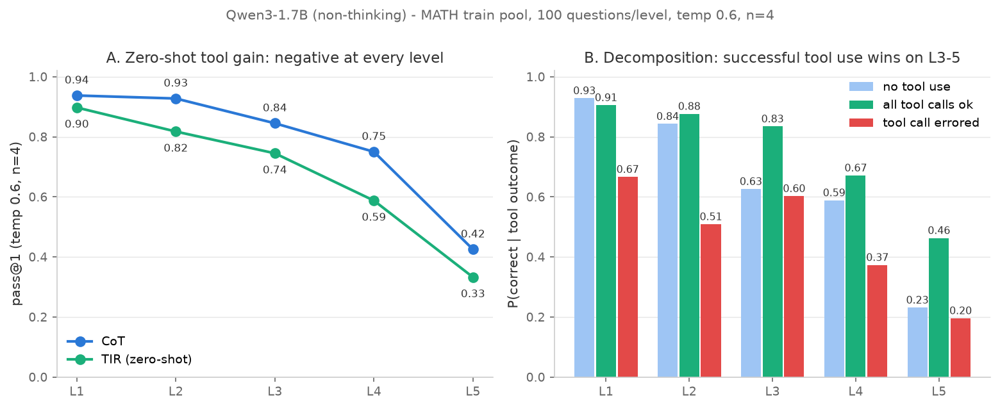

# ToolCredit 技术报告

> **多轮工具调用 RL 中的信用分配**（credit assignment in multi-turn tool-integrated RL）
> 负责人：陈冀超｜执行：Claude Code｜living document，每个 Milestone 验收后更新对应章节
> 配套文档：[PLAN.md](../PLAN.md)（实验设计权威）· [plans/](../plans/)（每 Milestone 的计划与偏差）
> · [LOG.md](../LOG.md)（流水）· 本报告负责**叙事与判读**，不替代上述文档

---

## 0. TL;DR（随进度更新）

| # | Milestone | 状态 | 一句话结论 |
|---|---|---|---|
| M0 | 环境打通 + smoke test | ✅ 2026-07-12 | GH200/aarch64 无 docker 平台上 veRL 0.8.0 multi-turn tool 全栈跑通；官方示例 val 0.76，smoke test 2 分钟 |
| M1 | 数据 + 工具增益预实验 | ✅ 2026-07-13 | **零样本工具增益全难度层为负（−10pt）**；机制分解证明潜在增益在 L3–5 真实存在（工具成功时 L5 翻倍）→ 负增益源于"不会用工具"而非"工具没用"，SFT 冷启动必要性获得定量证据；训练集定为 MATH L3–5 共 5403 条 |
| M2 | 沙箱 / verifier / masking 测试 | ✅ 2026-07-14 | reward 通路三地基全绿（56 tests）：沙箱含真禁网（unshare netns）；verifier 200 例审计的数学等价判定假阳性/语义假阴性均 0 检出，严格 boxed 口径另有 4/200 格式漏分；顺带修复 M1 判分 2 处假阴性；verl mask 构建验证无误 |
| M3 | SFT 冷启动 | ✅ 2026-07-14 | Qwen3-8B 本地蒸馏 10.4k 轨迹→拒绝采样 6k→LoRA SFT：工具报错率 34%→19%、弃用率 27%→7%、格式 93%；增益 −0.101→−0.032（L5 转正、L4 平价），剩余缺口=数学能力+教师未覆盖难题=RL 的活；SFT-6k 定为全部 RL 实验统一起点 |
| M4 | E3 GRPO baseline | ✅ 2026-08-20 | 标准轨迹级 GRPO 200 step 训稳：固定 MATH500-100 pass@1 **0.60→0.76**（峰值 0.77），KL/entropy/长度健康，工具错误、格式无效与截断均下降；建立 E5/E6 的可复现基准 |
| M5 | E6 no-mask / E4 shaping / E7 filtering | 🚧 阶段验收 2026-08-22 | E6 与两条 E4 正式 run 已完成：no-mask 确实让 4.662% loss token 来自环境返回，但 80 step 内未出现灾难性退化；exec shaping 增加调用和 hacking candidates，budget penalty 只小幅缓解，三条 recipe 的 final pass@1 为 E3/A/B=`0.76/0.77/0.76`，无稳定最终能力收益。E7 设计审查已完成，用户主动 defer 到 M6/E5 完成之后；不是实现失败或取消，M5 不 tag |
| M6 | E5 轮级信用分配 | ⬜ | |
| M7 | 评测 / 分析 / 报告 | ⬜ | |

---

## 1. 动机与研究问题

**背景**：单轮 RLVR（verifiable reward 的 RL）已经成熟，但真实 agent 是多轮的：模型发起工具
调用、环境返回结果、模型继续推理，循环若干轮后产出最终答案。这带来一个训练层面的结构性问题——

**研究问题（全项目只回答这一个）**：一条多轮工具调用轨迹只在末尾拿到一个对/错 outcome 奖励；
标准 GRPO 把组内相对优势**广播给全部轮次的所有 token**——第 2 轮的关键正确调用和第 5 轮的
报错调用拿到完全相同的梯度。引入轮级（turn-level）信用分配，对训练效率、最终性能、模型行为
分别有什么影响？

**与 QMIX 的同构性**（个人叙事线）：这与多智能体 RL 中"团队奖励如何分给个体"（QMIX 用值分解
网络解决）在结构上同构——轨迹奖励 vs 轮次信用。区别在路线：QMIX 学一个分解网络，本项目用
组内统计做免学习（learning-free）分配，零额外模型、零额外采样。

**任务载体**：数学推理 + Python 解释器（TIR, tool-integrated reasoning）。选它不是因为任务
本身新，而是因为它是多轮工具调用中 verifier 最可靠、社区参照最多的环境，噪声最小，适合
把"信用分配"这一个变量隔离出来。

**明确非目标**：不追 SOTA、不声明 novelty、不做分布式、不做 web/SWE agent。

**实验矩阵**（详见 PLAN §8–10）：E3 标准 GRPO baseline → E5 轮级信用分配（核心对照）；
E6 故意关闭工具 token loss mask（机制演示）；E4 奖励塑形、E7 DAPO 过滤（次级消融）。

---

## 2. M0 — 环境打通与 smoke test（2026-07-12，tag `m0`）

### 2.1 动机与风险定位

全项目最大的日程风险不是算法，是平台：训练机是 **GH200（Grace-Hopper，aarch64）JupyterHub
pod，无 docker、home 是 NFS、内核 64k page**。PyTorch/vLLM/flash-attn 生态的预编译 wheel
对 aarch64 支持不全，PLAN 因此把"第 1 天就验证官方示例能跑"设为最高优先级——这一步失败则
整个项目改租 x86 卡。

### 2.2 技术选型

| 组件 | 选择 | 理由 |
|---|---|---|
| 训练框架 | **veRL 0.8.0**（pin 死） | 原生 multi-turn rollout + tool calling；工业认可度；**不 fork**，一切改动走最小 patch（rl/custom/CHANGES.md） |
| rollout 引擎 | **SGLang 0.5.8**（veRL 官方 pin） | veRL multi-turn 官方路径；依赖链显式适配 aarch64（sgl-kernel 有 ARM wheel），免源码编译 |
| torch | 2.9.1+**cu129** | 见 2.4 踩坑链 |
| 多轮示例基准 | veRL 官方 agent-loop 教程（ReAct + 代码沙箱 + MATH + GRPO） | 约定"先原样跑通再改"；交互标记格式直接采用官方，不自己发明 |

### 2.3 结果

- **官方示例原样跑通**（run #5）：Qwen3-1.7B + MATH + 沙箱工具，step0 val acc **0.76**、
  平均 3.56 次工具调用（max 18）；5/5 GRPO 步完成，entropy 0.19–0.24、KL ~1e-4、
  grad_norm < 1、40–52 s/步、显存峰值 45 GB。训练 reward 逐步上行（0.50 → 0.69 @step4），
  说明工具行为可被 RL 快速改善——这个数字在 M1 判读中被再次引用。
- **smoke test**：20 条数据 + 1 梯度步全流程 **约 2 分钟**（预算 <10 分钟），
  作为一键回归检查保留（`scripts/run_smoke_test.sh`）。

### 2.4 关键踩坑（完整清单见 environment.md）

1. PyPI 的 torch aarch64 wheel 是 **CPU-only**，必须显式走 pytorch.org 的 cu 索引；
2. cu130 torch 与 sgl-kernel（CUDA12 构建）冲突 → 定格 **cu129**；
3. flash_attn 是 veRL 训练路径**硬依赖**（bert_padding.unpad，与注意力实现选择无关）：
   PyPI 无 aarch64 wheel，用上游 GitHub 官方 aarch64 wheel（cu13 变体）+ 系统 CUDA 的
   libcudart 解决，模型注意力仍走 sdpa；
4. veRL 0.8.0 一行 bug（sglang kernel 检查）：经用户批准打一行 patch，记录于
   rl/custom/CHANGES.md——遵守"不 fork、改动留痕"约定；
5. veRL 0.8.0 已移除旧版 sglang_multiturn GSM8K 示例，官方 multi-turn 路径现为
   **agent loop**（delta-based tokenization 构建 loss mask——M2 masking 测试的目标）。

### 2.5 面试叙事要点

- "我在一个 wheel 生态残缺的 ARM 平台上，两天内让工业级 RL 框架的多轮工具管线跑通"——
  证据链是 environment.md 的 6 个坑与解决顺序；
- 平台验证优先、失败即降级（租 x86 卡）的**风险前置**思维本身就是答案的一部分。

---

## 3. M1 — 数据与工具增益预实验（2026-07-13，tag `m1`）

### 3.1 动机：为什么先做预实验而不是直接开训

RL 训练数据的质量决定梯度信号的质量，具体到 GRPO + 工具调用有两个硬约束：

1. **工具要有用武之地**——若任务心算即可解（如 GSM8K），工具增益趋近零，任何信用分配
   方案的差异都会被噪声淹没（这是"为什么不用 GSM8K 训练"的实验性回答）；
2. **组内奖励要有方差**——全对/全错的题对 GRPO 优势为零，纯烧 rollout 算力。

因此 M1 用一个便宜的预实验（~1 小时 GPU）回答"**在哪个难度段、工具增益和梯度信号同时存在**"，
再据此选训练子集。

### 3.2 模型选择：Qwen3-1.7B（重要决策，经用户两轮讨论确认）

候选：Qwen2.5-3B-Instruct（PLAN 原定）/ Qwen3-1.7B / Qwen3-4B-Instruct-2507。决策维度：

| 维度 | 结论 |
|---|---|
| 管线风险 | Qwen3-1.7B 已被 M0 官方示例端到端验证，零额外风险 |
| 能力天花板是实验设计变量 | 模型太强（4B-2507 MATH500 ~85%+）→ 全对组多、组内方差消失、被迫换 AIME 级数据 → rollout 预算爆炸。**选"会做一半"的模型是有意为之** |
| 含错轨迹供给 | 模型较弱 → 轨迹含报错与恢复更多，而轮级信用分配的差异恰恰体现在含错误的轨迹上（全程无错时轮级≈轨迹级） |
| 算力 | 1.7B 最省 → M4 预算内可容纳 2–3 次失败重调 |
| 面试可辩护性 | "为什么小"比"为什么用两年前的模型家族"好答：单卡 3 周预算下选择跑完**完整对照矩阵**而非在大模型上跑一半；研究问题与规模正交；余力时 4B 复跑兜底 |

全程固定 `enable_thinking=False`（非 thinking 模式），消除思维链长度这一混淆变量。

### 3.3 数据集构建

| 数据集 | 规模 | 角色 |
|---|---|---|
| MATH train（DigitalLearningGmbH/MATH-lighteval 预处理版） | 7496（剔 2 条 Level ?、2 条空标答） | 训练池 |
| MATH500 | 500 | 主评测集 |
| AIME 2024 / 2025 | 各 30 | 低污染评测（时间晚于基座知识截止） |
| GSM8K test | 200 | sanity check |

统一 JSONL schema（id/question/answer/level/subject/source/split），训练/评测严格分 split。

**污染检查**（`data/dedup_check.py`，归一化精确匹配 + 词级 13-gram）：命中 216/7496
（2.9%）。逐条检视发现仅 1 条精确匹配，其余 215 条 13-gram 命中**几乎全是答案格式模板句**
（"where $m$ and $n$ are relatively prime positive integers, find $m+n$" 一句就贡献 120 条
——AIME 标准答案格式）。按 PLAN 保守处理全部剔除（净池 7280）：多删 3% 无害，
且"n-gram 方法会把格式 boilerplate 当污染"本身是值得讲的方法论细节。

### 3.4 工具增益预实验：方法

- **抽样**：净池按 level 分层 100 题/层（seed 42），共 500 题；
- **两臂**：(a) CoT——纯文字推理；(b) TIR——挂 `code_interpreter` 工具（hermes 格式、
  官方 SandboxTool 同款 schema、max_turns=4 超限截断判 0）。**TIR 臂与 M4 训练时的
  verl tool_agent 设置严格一致（无 system prompt）**——probe 测的是训练环境里的增益，
  不是精心调 prompt 后的增益；
- **协议**：温度 0.6、top_p 0.95、n=4，pass@1 = 4 次采样正确率均值；math-verify 判分；
  判分失败不静默跳过，计入 invalid_rate（本次两臂均为 0）；
- **基础设施**：sglang server + 异步并发 client，4000 条对话约 4 分钟；断点续跑；
  轨迹全量落盘（`data/probe/`）。

**过程中发现并修复官方示例工具的两个缺陷**（记入偏差表，M2 自建工具沿用修复版）：
官方"最后一行强制包 print"的启发式在缩进行/赋值行上直接制造 SyntaxError（自伤工具报错率），
改为 AST 判断裸表达式才包装；官方 ```` ```py ```` 正则会把 ```` ```python ```` 的 "thon" 吃进
代码。

### 3.5 结果：零样本工具增益全难度层为负



| Level | CoT pass@1 | TIR pass@1 | 增益 | 工具报错率 | 截断率 |
|---|---|---|---|---|---|
| 1 | 0.927 | 0.887 | −0.040 | 0.166 | 0.015 |
| 2 | 0.927 | 0.818 | −0.110 | 0.301 | 0.048 |
| 3 | 0.845 | 0.745 | −0.100 | 0.317 | 0.068 |
| 4 | 0.750 | 0.590 | −0.160 | 0.392 | 0.100 |
| 5 | 0.425 | 0.333 | −0.092 | 0.456 | 0.145 |

这触发了 PLAN 的降级条款（全层增益 <3pt → 停下报告用户）。**但降级条款预设的诊断
（"数据太简单、心算即可"）与证据不符**——瓶颈不是数据，是模型。

### 3.6 机制分解：负增益 = 潜在增益 × 执行不可靠

把 TIR 臂按工具使用结果分解（同一难度层内部对比，排除跨层混淆）：

| Level | P(对 \| 未用工具) | P(对 \| 工具全成功) | P(对 \| 工具有报错) |
|---|---|---|---|
| 3 | 0.626 | **0.835** | 0.603 |
| 5 | 0.231 | **0.463** | 0.196 |

三条证据链共同支撑"不会用工具，而非工具没用"的结论：

1. **工具成功执行时 L3–5 显著更高**（L5 翻倍）。存在"简单题代码更容易写对"的选择偏置，
   但翻倍的幅度难以全由偏置解释；
2. **失败模式具体可指**（人工轨迹归类）：跨调用假设变量还在（沙箱是无状态子进程）、
   漏 import、代码带缩进、报错→重试→烧光 4 次调用被截断（L5 截断率 15%）；
3. **三个诊断对照**（20 题 dry-run）：加引导 system prompt 更差（强推工具放大失败面）；
   1-shot 示例让模型学会"少用工具"（未用率 66%），成绩向 CoT 回归而非超越；
   greedy 把报错率从 48% 压到 18% 但增益仍负——温度采样放大代码脆性
   （代码错一个 token 即崩，文字推理更鲁棒），但不是根因。

**类比**：给没学过计算器的人发计算器，且按错扣分——他裸算 75 分，带计算器反而 59 分。
结论不是计算器没用，是他还不会用。

### 3.7 决策与影响

- **不换数据**（推翻降级条款的字面动作）：更难的题只会让零样本代码更差；
- **选集标准从"零样本增益为正"改为"潜在增益 + 组内方差"**：两者都集中在 L3–5
  （TIR 组内混合结果占比 L3–5 为 0.44/0.49/0.51 vs L1 0.17）→
  训练子集 = 净池全部 L3–5，共 **5403 条**，污染复检 0 命中；
- **M3 SFT 冷启动从"经验假设"升级为"有定量证据的必要步骤"**，并新增验收项：
  SFT 后复测 CoT vs TIR，验证"SFT 解锁工具增益"的判读（probe 脚本直接复用）；
- 佐证：M0 官方示例 5 步 GRPO 训练 reward 0.50→0.69，工具行为确实可被训练快速改善，
  与 ToRL/ReTool"TIR 增益来自训练而非 prompting"的设定一致。

### 3.8 面试叙事要点

- 这是一个**否定性结果被机制分析变废为宝**的完整案例：预实验否定了 PLAN 的预设 →
  分解分析找到真实瓶颈 → 推翻计划字面降级动作、给出更对的路线 → 下游步骤（SFT）的动机
  从"别人都这么做"变成"我自己的数据说必须做"；
- 可引申讨论：为什么 prompt 工程（system prompt / few-shot）修不好执行可靠性；
  温度对代码 vs 文本推理的不对称影响；n-gram 去污染的 boilerplate 假阳性问题。

---

## 4. M2 — 沙箱加固、verifier 审计与 loss masking 测试（2026-07-14，tag `m2`）

### 4.1 动机：reward 通路的三类隐蔽失败

RL 里最贵的 bug 不是训练崩（看得见），而是**训练"成功"但优化了错误目标**。M2 针对三个
入口各修一道防线：沙箱被失控代码搞挂（训练中断）、verifier 误判（reward 直接错，假阳性
= hacking 入口）、loss mask 错误（可能让模型学习环境输出；E6 后续故意放开 mask 检验该风险，
实际短窗结果见 §7）。

### 4.2 沙箱（`env/sandbox.py` + 20 tests）

子进程执行 + 全进程组超时清杀 + 资源限制（内存 1GB / 文件 16MB / CPU / 进程数动态上限）
+ 一次性 tmp 工作目录 + **真禁网**——预判"无 root 的 pod 上 user namespace 可能被禁"，
实测 `unshare --map-root-user -n` 可用，网络隔离以 fresh netns 实现并有测试。恶意 payload
测试全过：fork 炸弹、死循环、内存炸弹、删文件企图、超长输出。**诚实记录的差距**：同 uid
绝对路径的文件删改挡不住（无 mount namespace remount 权限），用一个"钉住现状"的测试
把该差距文档化——工业级方案是 container/gVisor，面试可以讲清楚这一档差在哪。

### 4.3 Verifier（`rewards/` + 30 tests + 200 例人工审计）

判分链：归一化字符串精确（确定阳性，快）→ math-verify（主路径）→ sympy 规范化（fallback）。
**双口径设计**：训练 reward 严格只认 `\boxed{}`（防"多写候选数字撞答案"的 hacking），
评测宽松提取。复合奖励 `1.0·对错 + 0.1·格式 (+E4 shaping 项，默认 0)`，默认保持 sparse
——这是 E5 对照的实验前提（见 qa_log Q4）。

**审计**（200 对真实 probe 输出 × 人工核对，reports/02_appendix_verifier_audit.md）：
数学等价判定的假阳性和语义假阴性均为 **0 检出**；计入格式门后，严格训练口径为
TP=160、FP=0、FN=4、TN=36，其中 4 个 FN 全是“答案对但没装箱”的有意格式拒绝；
审计顺带抓出 **M1 probe 判分的 2 处假阴性**（`20\%` 类 gold），判分统一到新 verifier 后
全量重算 M1 指标——各 level 变化 ≤1pt、结论不变。这个"审计发现上游判分 bug 并回灌修复"
的闭环本身是质量流程的最好证据。

### 4.4 Loss masking 单元测试（`rl/custom/test_masking.py`，本项目最重要的单元测试）

定位 verl 0.8.0 mask 构建：`ToolAgentLoop` 状态机中生成段 `+=[1]*n`、工具返回段增量
tokenize 后 `+=[0]*n`。测试用真 Qwen3 tokenizer + 真 hermes parser + 真 FunctionTool，
只 mock LLM server（脚本化 2 次工具调用轨迹），驱动**真实 verl 状态机**断言：模型 token
mask 全 1、工具返回 token 全 0、prompt 完全在 response 之外、截断时对齐、padding 归零。
结论：verl 的 mask 构建无误（不需要动框架）。附带发现一个易误用的契约：verl 用
`tokenizer.pad` 填充 mask 列表（填入的是 pad_token_id≠0！），靠乘 response attention mask
归零——测试把这个契约钉住了。

### 4.5 面试叙事要点

- "假阳性和假阴性哪个危害大"有自己的审计数据支撑（语义误判 0 检出、严格格式漏分
  4/200、修复案例与 rule-of-three 上界）；
- masking 测试的方法论：不改框架、mock 到最小面（只有 LLM server 是假的）、断言打在
  token/mask 对齐这个最终不变量上；
- 沙箱的"能挡什么/挡不住什么"分界清晰且各有测试——包括故意钉住已知差距的测试。

## 5. M3 — SFT 冷启动（2026-07-14，tag `m3`）

### 5.1 动机与教师选型

M1 已定量证明：零样本负增益源于工具执行不可靠——SFT 的任务不是教数学，是教
"接口行为"（hermes 格式、无状态沙箱纪律、读输出续推理、boxed 收尾）。教师选型经
成本/合规/格式三维讨论（qa_log Q7）：Claude/Codex 有 ToS 蒸馏限制且订阅非批量 API；
API 教师 ~$10–20 非必要；**本地 Qwen3-8B**——零成本、零合规风险、hermes 原生零格式转换、
生成基础设施直接复用 M1 probe。关键机制：**拒绝采样使教师准确率只影响产量、不影响
数据正确性**（教师"新旧/强弱"由此与数据质量解耦）。

### 5.2 数据管线

10406 条原始轨迹（5203 题 × 2，temp 0.7，bare TIR、沙箱真实执行）→ **五条件拒绝采样**
（严格 boxed 判对 / ≥1 次成功工具调用 / 未截断 / ≤3072 token 装进学生训练预算 /
工具参数键干净）→ **6056 条**（58%），含 797 条报错恢复轨迹（E5 最需要的样本类型，
特意保留"有报错但最终答对"的轨迹）。教师成绩单：L3/4/5 准确率 0.854/0.763/0.569，
题目覆盖率 83%/76%/**59%**——L5 四成题目教师产不出合格轨迹，是 SFT 天花板的来源（§5.4）。

### 5.3 训练：SFT 样本与 RL rollout 逐 token 同构

放弃自写 delta-tokenization collator，改为**把教师轨迹经真实 verl ToolAgentLoop 重放**
（`sft/trace_tokenizer.py`：FakeServer 吐教师回合、Fake 工具吐记录的沙箱输出，驱动
M2 已验证的状态机）——SFT 的 input_ids/labels 与 M4 rollout 的 tokenization **由构造保证
一致**，消灭 train/rollout 格式失配这类最隐蔽的 bug。LoRA r32/α64、2 epoch、14 分钟，
merge 成完整 checkpoint 供 verl 直接加载。

### 5.4 结果与判读（500 题复测，同 M1 协议）

| | 零样本 | SFT-2.5k | SFT-6k |
|---|---|---|---|
| TIR pass@1 | 0.676 | 0.686 | **0.704** |
| 工具增益 | −0.101 | −0.056 | **−0.032** |
| 工具报错率 / 弃用率 | 0.34 / 0.27 | 0.22 / 0.09 | **0.19 / 0.07** |

- **SFT 的设计目标（执行可靠性）达成**，且随数据量单调改善（2.5k→6k 敏感性实验）；
- **增益未完全转正的两个明确原因**：残余负增益在 L1–3（CoT 0.84–0.91 无需工具、
  不在训练池；训练池 L4–5 已平价/转正 +0.03）；教师未覆盖的 41% L5 难题 SFT 教不了
  （拒绝采样难度偏置）——两者都指向"剩余差距是 RL 的工作"；
- GRPO 前提复核：组内混合结果占比 L3–5 = 0.39/**0.54**/0.48，梯度信号充足；
- 验收两项边缘指标（格式 93% vs held-out 89.5%、pass@1 提升 p≈0.06）**如实标注**，
  经用户确认接受进 M4。

### 5.5 最小改进复核（2026-08-19）

- 30B teacher probe 未改善核心产量：有效 yield 52% vs 8B 的 53%，总体/L5 题目覆盖
  69%/63% vs 68%/65%，因此停止且不做全量 30B 生成。
- 同数据 full SFT 的 held-out 200 对照：TIR/CoT pass@1 为 0.5188/0.5900（LoRA：
  0.5100/0.5725），但工具错误率/弃用率为 0.2654/0.1150（LoRA：0.2013/0.1050）。
  小幅准确率变化不足以抵消可靠性退化，最终仍保留 LoRA SFT-6k checkpoint。

### 5.6 面试叙事要点

- "教师准确率 vs 数据质量解耦"（拒绝采样）与"SFT 教格式、RL 提能力"的分工，都有
  自己的数字支撑（覆盖率表、单调收窄的增益曲线）；
- 重放式 tokenization 是个值得讲的工程决策：不重写机制，用被测过的真机制生成数据；
- 过程中抓的两个小事故也有价值：教师会写出参数键错误的 tool call（数据质检第五条件的
  由来）、等待脚本抓错日志（流程纪律教训）。

## 6. M4 — E3 主 baseline：multi-turn GRPO（2026-08-20，tag `m4`）

### 6.1 动机与对照边界

M4 的任务不是证明新的信用分配方法，而是先把标准 GRPO 的 E3 基准训稳。它把同一条轨迹的
组相对优势广播给所有模型生成 token；后续 E5 只改信用分配，数据、SFT 起点、rollout、reward
和评测协议都要以本 run 为对照。若 E3 本身不稳定，E5 的任何差异都无法归因。

统一起点为 M3 的 `sft/checkpoints/qwen3-1.7b-sft`。训练池是移除 held-out 后的 5203 条
MATH L3–5，固定验证集为按 level 各 20 题分层抽样的 MATH500-100。标准 GRPO 使用
64 prompts × 8 rollouts、lr 1e-6、loss 内 KL 0.001、clip 0.2/0.28、最多四次工具调用、
3072 response tokens，共 200 step，每 25 step 保存和验证。

### 6.2 工程接线与失败驱动修正

没有 fork 或修改 veRL 内部。训练工具、reward 与 agent loop 都经官方配置扩展点注入：工具执行
复用 M2 的 `env/sandbox.py`，严格 boxed reward 复用 `rewards/composite_reward`。三次 smoke
依次暴露了零工具轨迹缺少动态列、Hermes parser 错误只写日志、DataLoader worker 收尾被杀；
对应修正是给轨迹计数补显式零值、把 parser/dispatch 错误纳入 `invalid_rate`、正式配置使用
`dataloader_num_workers=0`。最终 smoke 5/5 且退出干净。

正式 run 在 step 169 rollout 期间遭遇 JupyterHub pod 重启。文件与 TensorBoard 审计确认
step 168 已完成、最新完整 checkpoint 为 150；恢复前归档旧 151–168 预测，并从 checkpoint 150
恢复 model/optimizer/scheduler/RNG/DataLoader，跳过已完成的 step-150 启动验证。同一 run 最终
完成 200 step。这个事故验证了 checkpoint 可恢复性，也说明异步 rollout 的恢复不承诺 bitwise
重现；正式指标只读取恢复后的 canonical step 文件。

### 6.3 主结果

| Step | 0 | 25 | 50 | 75 | 100 | 125 | 150 | 175 | 200 |
|---:|---:|---:|---:|---:|---:|---:|---:|---:|---:|
| MATH500-100 pass@1 | 0.60 | 0.67 | 0.67 | 0.70 | 0.73 | 0.73 | 0.74 | **0.77** | **0.76** |

最终 +16pt，且提升分布在多个连续验证点，不依赖挑选峰值。step 200 比峰值少 1 题；固定验证集
只有 100 题，因此不把 0.77 与 0.76 的差异解释为真实性能回落。训练 reward 的前/后 25-step
均值为 0.589/0.782。

稳定性证据：entropy 从 0.202 到 0.309（范围 0.187–0.321），没有单调坍缩；actor PPO KL
范围约 −9.81e−5–1.37e−4，未飙升；每 step 平均响应长度最高 1342、最终 1156，未逼近
3072 上限。训练前/后 25-step 均值显示，截断率 6.30%→0.55%、工具错误率 12.84%→7.66%、
parser 错误轨迹率 1.45%→0.61%、格式无效率 10.30%→3.14%。固定验证集的格式成功率
87%→95%、工具错误率 9.50%→5.25%、截断率 8%→1%。换言之，pass@1 提升同时伴随接口行为
改善，没有“reward 上升但真实评测不动”的明显 hacking 信号。

### 6.4 验收、限制与后续用途

run 五件套、TensorBoard、200 份训练预测、9×100 条验证预测和 step-200 完整 checkpoint 均
落盘；数据 split/哈希/污染检查通过，真实 pod 权限下 74 项测试全绿。M4 因而达到 PLAN §8
“稳定提升 + 无病态曲线 + 一页摘要”的全部门槛。

限制有三点：这里只是固定 100 题 greedy n=1 的阶段性验证，完整 MATH500/AIME 留给 M7；
最终验证仍有 12% invalid，主要由 verifier 无法判定或格式问题组成；本阶段只有 E3，无法回答
turn-level credit 的因果收益。它的价值是给 M5 的 E6/E4 和 M6 的 E5 提供严格可比的配置、
曲线与行为基线。

### 6.5 面试叙事要点

- baseline 的价值是“可归因”：先证明标准 GRPO 在同一栈上稳定工作，再只改信用分配变量；
- 训练健康不能只看 reward：同时用 eval、KL、entropy、长度、工具/parser 错误、invalid 和
  全对/全错组约束解释空间；
- 中断恢复展示了实验可追溯性：区分“已生成”与“已 checkpoint”，保留旧预测、从完整状态
  恢复并避免重复验证，而不是把不连续 run 伪装成一次连续训练。

## 7. M5 — E6 no-mask、E4 reward shaping 与 E7 review gate（阶段验收：2026-08-22）

### 7.1 动机与实验边界

M5 不改变信用分配算法，而是先回答三个会直接影响后续 E5 解释的问题：

1. **E6 no-mask**：如果错误地把 environment/tool return token 也纳入 policy loss，是否会导致
   环境输出复读、伪造或固定评测崩溃？这是 mechanism/diagnostic experiment，不预设结果必须为负。
2. **E4 reward shaping**：给成功执行工具一个 dense bonus，是否改善学习效率；如果诱发 over-calling，
   对超过三次调用加小额 budget penalty 能否缓解？
3. **E7 dynamic filtering**：按真实 GRPO scalar `score` 丢弃组内零方差 prompt，并补采样到每次
   effective update 有 64 个 informative groups，能否提高单位采样/时间效率？这需要介入 trainer
   data flow，因此在实现前单独过边界审查。

三组实验继续从同一个 `sft/checkpoints/qwen3-1.7b-sft` 独立启动，冻结 E3 的 5203 条训练池、
MATH500-100 fixed panel、seed、64 prompts × 8 rollouts、生成参数、optimizer、KL、clip、sandbox、
verifier 和最多四次工具调用。E6 只改变 tool-return loss mask；E4 只改变 reward kwargs；任何
shaped score 上升都不能直接解释为数学能力提升。

E4 在看结果前冻结为两条必做 run：

\[
r_A=r_{base}+0.2\frac{n_{success}}{n_{calls}},
\qquad
r_B=r_A-0.1\max(0,n_{calls}-3),
\]

其中 `n_calls=0` 时 execution fraction 定义为 0，工具预算耗尽且没有 boxed final answer 的轨迹仍
按 E3 协议总 reward=0，shaping 不“救活”截断轨迹。E4-A 隔离 execution bonus；E4-A→E4-B
隔离 budget penalty；E3→E4-B 只代表完整 joint recipe 的总体效果。

### 7.2 接线、测试与运行纪律

没有 fork、升级或直接修改 veRL site-packages：

- E6 使用 repo-local `ToolCreditNoMaskAgentLoop`，复用原状态机，只把真实 tool-return segment 的
  response mask 从 0 改为 1；prompt 仍不在 response tensor 中，padding 仍由 attention mask 归零。
  每条轨迹同时记录原 policy token、tool-return token 和 no-mask loss token，并做逐条守恒检查。
- E4 复用同一个 `rl/custom/reward.py:compute_score` 和严格 verifier，通过现有
  `reward_kwargs` 注入 `lambda_exec/lambda_budget/budget`。E3 不传 kwargs 时字段和值保持 golden
  behavior；A/B 额外落盘 base score、exec fraction/bonus、budget penalty、success count 和 final score。
- resolved-config 门禁证明 E3→E6 只有 mask/run metadata/80-step 上限差异，E3→A 只有 exec reward
  与 run metadata 差异，A→B 只有 budget penalty 与 run metadata 差异。
- 两类实验都先完成 unit/config tests、5-step smoke 和人工轨迹检查才启动正式 run；通过的 E4-B
  smoke checkpoint 按用户指令删除约 21 GiB，只保留 resolved config、分析、metrics、summary、
  TensorBoard 与 `checkpoint_cleanup.json`。全仓已无可见 smoke checkpoint 目录。

最终分组回归为 **105 passed、1 skipped**。pod 将删除 `/etc/hostname` 的拒绝从 EACCES 表现为
EROFS，因此 sandbox test 接受 `PermissionError` 或 read-only filesystem，但仍严格断言操作失败且
文件存在；这没有降低隔离安全要求。

三个正式 run 均用 tmux、唯一 run name、25-step checkpoint/eval 和轻量 watcher。E4-A 在写 step 150
checkpoint 时 pod 中断，只从 tracker 指向的完整 step 125 恢复；旧 train 126–149 和半写 checkpoint
归档。E4-B 在 train 172 后中断，只从完整 step 150 恢复，旧 151–172 归档。两次恢复都先核对
resolved config、数据/SFT hash、GPU/磁盘，正式曲线只读恢复后重算的 canonical files。

### 7.3 E6：操纵生效，但灾难性负效应未复现

正式 run `e6_nomask_20260820_235621` 完成 80/80，没有触发预注册 early stop：

| Step | 0 | 25 | 50 | 75 | 80 |
|---:|---:|---:|---:|---:|---:|
| E3 pass@1 | 0.60 | 0.67 | 0.67 | 0.70 | — |
| E6 pass@1 | 0.61 | 0.71 | 0.74 | 0.68 | 0.70 |
| 同 step 差值 | +0.01 | +0.04 | +0.07 | −0.02 | — |

41,460 条 train+validation 轨迹共有 37,964,808 个 E6 loss token，其中 1,769,932 个来自 tool return，
整体占 **4.662%**；单步前/后 25-step 均值由 6.54% 降至 3.35%，说明模型后期减少工具返回暴露，
但 treatment 绝非空开关。entropy 最低 0.176，平均 response length 最高 1,152，单步 truncation
最高 11.7%；`|KL|>0.01` 最长只连续 1 step，均未达到预注册病理阈值。

自动筛出 2,435 条复读/伪造候选，其中许多只是多次真实调用返回同一数学结果。19 条人工审计为
`repeat=7`、`legitimate_quote=6`、`forge=6`；6 条 forge 都是 parser 失败后模型生成不完整
`<tool_response>` wrapper，仅约占全部轨迹 0.0145%，远低于“系统性环境输出伪造”的早停条件。
step 75 的 tool/parser error 有恶化迹象，但 fixed-panel 只比 E3 低 2pt，没有形成共同退化证据。

因此正确结论不是“mask 无关紧要”，也不是“经典 no-mask bug 必然崩”：**在 Qwen3-1.7B、四轮工具
预算和 80-step 观测窗内，环境 token 确实进入了梯度，但灾难性 fixed-panel 退化和大规模伪造没有
复现。** 可能原因包括 treatment 暴露仅 3–8%、工具返回较短且高度规律、模型很快减少工具调用，
以及 80 step 不足以观察更慢的分布漂移。E6 仍证明了 mask audit 必须落到 token 级，不能只相信配置。

### 7.4 E4：exec bonus 抬高 reward 与调用，budget penalty 只弱修正

两条正式 run 都独立完成 200 step。固定 panel 主结果为：

| Run | 0–100 normalized AUC | 首次达到 0.67 / 0.70 / 0.73 | final / peak | mean base / shaped score |
|---|---:|---|---|---|
| E3 sparse | 0.67625 | 25 / 75 / 100 | 0.76 / 0.77@175 | 0.70917 / 0.70917 |
| E4-A exec-only | 0.66625 | 75 / 75 / 75 | 0.77 / 0.77@200 | 0.70565 / 0.88492 |
| E4-B joint | **0.68500** | 50 / 50 / 75 | 0.76 / 0.76@200 | 0.70742 / 0.88661 |

完整 validation 曲线：

- E4-A：`0.61/0.63/0.62/0.74/0.74/0.71/0.68/0.73/0.77`；
- E4-B：`0.60/0.64/0.72/0.73/0.70/0.74/0.74/0.72/0.76`；
- step 顺序均为 `0/25/50/75/100/125/150/175/200`。

A 的平均 exec bonus 为 0.17928，B 为 0.18030；B 的平均 budget penalty 只有 **0.00110**。因此
`0.8849/0.8866` 的 shaped score 主要是 reward 定义平移，而 base score 与 E3 几乎相同。行为对比如下：

| 训练轨迹指标 | E3 | E4-A | E4-B |
|---|---:|---:|---:|
| mean tool calls | 0.96273 | **1.30503** | 1.28346 |
| per-call success rate | 0.80532 | 0.86151 | **0.86473** |
| 4+ call fraction | 0.02707 | 0.03527 | 0.03259 |
| repeated-code candidate rate | 0.02019 | 0.02503 | 0.02183 |
| trivial-code candidate rate | 0.00167 | 0.01275 | 0.00604 |
| unused-result heuristic rate | 0.20420 | 0.30405 | 0.28190 |
| tool error rate | 0.07897 | 0.06999 | 0.06839 |
| invalid rate | 0.20060 | 0.19507 | 0.19873 |
| parser error rate | 0.00752 | 0.00872 | 0.00863 |
| truncation rate | 0.01697 | 0.02281 | 0.02158 |

E4-A 自动筛出 57,240 条非互斥 candidates，20 条分层人工审计为
`redundant_repeat=6/trivial_exec=4/unused_result=2/legitimate_use=8`。E4-B 有 55,136 条 candidates，
人工标签为 `7/4/2/5`，另有 `uncertain=2`；4 条 budget-boundary 候选中 2 条 legitimate、2 条
uncertain，没有确认 penalty avoidance，但样本太少，不能据此宣称这种行为不存在。自动候选是
高召回启发式，人工样本也是按候选类型分层抽取，二者都不是总体 hacking rate 的无偏估计。

### 7.5 三组预注册比较与因果判读

1. **E3 → E4-A（execution bonus）**：early AUC −0.0100、final +0.01，mean calls +0.34230，
   repeated/trivial/unused rates 分别 +0.00484/+0.01108/+0.09985。bonus 提高了执行成功率并降低
   tool error，但显著扩大工具调用和可疑行为面；+1 题 final 与 −1pt early AUC 不支持稳定能力收益。
2. **E4-A → E4-B（budget penalty）**：early AUC +0.01875、final −0.01，mean calls −0.02157，
   4+ calls −0.00269，repeated/trivial/unused 分别 −0.00320/−0.00672/−0.02216。方向上符合“轻微
   纠偏”，但 treatment 平均只有 0.00110，effect size 小，且 final 没保住 A 的 +1 题。
3. **E3 → E4-B（完整 joint recipe）**：early AUC +0.00875、final 0，mean calls +0.32072；三类
   heuristic rates 仍分别比 E3 高 +0.00164/+0.00437/+0.07770。完整 recipe 的最好证据是更早达到
   中间阈值，而不是更高最终能力；代价是持续 over-calling。

总体上，M5 不支持“dense process reward 自然带来能力提升”。execution bonus 学到的最直接行为是
“更多且更成功地调用工具”，其中既有 legitimate use，也有 trivial/redundant/unused calls；小额 budget
penalty 能沿预期方向修正一部分行为，却因只有第四次调用才生效而暴露太弱。按预注册纪律没有追加
budget-only、调大 penalty、额外 seed 或事后重跑。

### 7.6 E7：设计审查完成后主动 defer

对 veRL 0.8.0 pin 源码的只读审计确认：`algorithm.filter_groups` 没有被原生
`RayPPOTrainer.fit()` 读取，YAML-only 会形成“配置看似开启、实际未过滤”的假实验。动态补采样必须
在 reward 已得到、old log prob/advantage 尚未计算时消费额外 dataloader batches；当前 pin 没有该 hook。

拟议实现只新增 repo-local `DynamicFilterRayPPOTrainer` 和 `DynamicFilteringTaskRunner`：复制并锁定
约 409 行 upstream `fit()` 与约 93 行 `TaskRunner.run()`，把 1–4 个 `64 prompts×8 rollouts` 的
候选 chunk 按 UID 和实际 scalar `score` 严格零方差筛选，凑齐前 64 个 informative groups 后才复用
原生 old/ref log prob、GRPO advantage、actor update 和 validation。候选循环保持同一冻结 actor snapshot；
成功/异常路径都保证 rollout replicas sleep；checkpoint ledger 在 upstream tracker 前原子落盘，恢复时
严格绑定 effective step，并同时报告 per-update、trajectory、rollout-token 和 wall-clock 效率。

E3 仍必须走原生 `RayPPOTrainer`，不改 site-packages、不 fork/升级 veRL。完整边界和源码 SHA 见
`plans/M5_E7_IMPLEMENTATION_REVIEW.md`。截至本节写作时，**E7 trainer/config/launcher 尚未创建，
smoke/full run 均未启动**。用户于 2026-08-22 明确将 E7 有意 defer 到 M6/E5 完成之后；这是执行
时序调整，不是实现失败、blocked 或取消。M5 保持阶段验收状态且不 tag；未来恢复 E7 时仍需重新核对
pin 源码并获得 exact-boundary 专项批准。

### 7.7 限制与可迁移结论

- fixed panel 只有 100 题，1pt 就是一题；A final +1pt、B 与 E3 持平都不应被过度解释。完整
  MATH500/AIME 与 bootstrap 置信区间留给 M7。
- 当前只有单 seed。预注册预算禁止自动追加 seed，所以 early AUC 的小幅差异只能视为探索性证据。
- E6 的 80-step 上限适合回答短期机制故障，不排除更长训练、工具返回更长或更高调用率环境中的
  慢性退化。
- hacking 自动规则与分层人工审计用于发现具体行为，不提供总体发生率的无偏估计；真实 taxonomy
  需要 M7 统一抽样。
- E4-B penalty 只影响第四次调用，平均 treatment exposure 很低；结果说明的是这组预注册系数，
  不能外推为所有 budget regularization 无效。
- 两次 pod recovery 保持配置和最后完整 checkpoint 一致，但异步 rollout 不保证 bitwise 重现；结论
  依赖 canonical 文件、归档 ledger 和 fixed panel，而非声称逐 token 完全确定性。

### 7.8 面试叙事要点

- **反预期结果也有价值**：E6 操纵通过 token ledger 证明生效，但没有为了讲故事宣称“必然崩”；
  将结论约束为当前暴露率和 80-step 窗口内的 null/weak effect。
- **reward 与能力分开读**：shaped score 上涨约 0.18，但 base score/fixed pass@1 几乎不动；同时
  tool calls 和 unused-result candidates 上升，是典型的“优化了指标定义，不等于提高任务能力”。
- **消融矩阵支持因果边界**：E3→A 隔离 exec bonus，A→B 隔离 penalty，E3→B 只解释完整 recipe；
  没有把 joint comparison 偷写成单因素结论。
- **恢复纪律也是研究质量**：只从 tracker 指向的完整 checkpoint 恢复，先归档会重算的轨迹和半写
  checkpoint，正式分析只读 canonical files；长跑中断没有被隐藏。
- **知道什么时候必须停下来 review**：发现 E7 不是 YAML 开关后，没有伪造 filtering 已开启，也没有
  直接复制 trainer；先给出 exact method、复制量、状态恢复和不变量，再等待批准。

### 7.9 证据索引

- 权威计划、执行偏差与验收表：`plans/M5.md`；E7 边界：`plans/M5_E7_IMPLEMENTATION_REVIEW.md`。
- E6：`rl/runs/e6_nomask_20260820_235621/`，含五件套、`analysis/mask_audit.json`、2,435 条
  candidates 与 19 条人工标签。
- E4-A/B：`rl/runs/e4a_exec_only_20260821_040632/`、
  `rl/runs/e4b_joint_shaping_20260821_153100/`，各含五件套、candidate manifest、20 条人工标签和
  recovery ledger。
- 三方机器可读比较与解释：`rl/runs/m5_e3_e4_comparison/e3_e4a_e4b_comparison.json`、`summary.md`。
- E4-B smoke checkpoint 删除证据：
  `rl/runs/e4b_joint_shaping_smoke_20260821_151700/checkpoint_cleanup.json`。

## 8. 路线图与当前状态

**当前**：M5 的 E6、E4-A、E4-B 和统一分析已完成并进入阶段验收；E7 exact implementation boundary
设计审查也已完成，但用户有意 defer 到 M6/E5 完成之后。E7 未实现、未失败、未取消；M5 不提交完成
tag。

**接下来**：新会话进入 M6/E5 turn-level credit。M6 完成后若用户恢复 E7，再基于
`plans/M5_E7_IMPLEMENTATION_REVIEW.md` 重新核对 pin 源码和资源并申请专项批准；在此之前不创建 E7
trainer/config/launcher，不运行 smoke/full run。M7 全量评测仍在其后。

**风险登记簿**（活跃项）：
- DataLoader worker 收尾被杀已在 M4 smoke 复现并以 `dataloader_num_workers=0` 消除；后续
  长跑沿用并继续监控；
- NFS checkpoint 已由 M4/M5 的多个约 21 GB 恢复点和两次真实 pod recovery 验证，但中断可能
  留下半写目录；仍以 atomic tracker 为唯一恢复依据并先归档重算区间；
- 当前磁盘仅余约 170 GiB（96% used），E7 raw candidate evidence 与正式 checkpoints 启动前必须
  重新预算，不能通过删除历史正式 run 腾空间；
- E7 与 pin veRL `fit()` 强耦合，当前按用户决定 defer 到 M6/E5 之后；未来获专项批准后用 upstream
  SHA、差分测试和 resume ledger 防止无声漂移；
- 5090 本地链路待用户复跑 smoke test（不阻塞服务器侧进度）。
